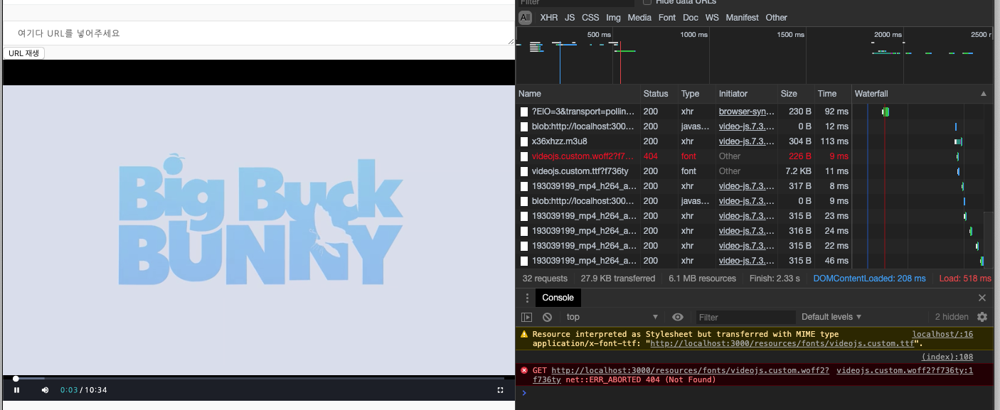

# 클론 코딩 



## 목적
* 네이버 클라우드 플랫폼에 Media Player 를 따라해보고, 공부한다. 
* 상업적 이용은 절대 하지 않는다. -> Study 용
* 소스를 분석하여 해당 서비스에 맞게 변형 시켜보도록 한다. 
* 컴포넌트를 구성하는 부분을 나누어 언제든지 디자인 할수 있게 Custom page를 만들어 본다. 

# 클론대상
http://kjwqlsawnlxj1099443.cdn.ntruss.com/demo/hlsplayer


# 업데이트

## 2019 11 19 
* cdn 충돌로 인해 PIP 적용이 되질 않앗음. 7.3.0 -> brightcove 에 cdn 을 적용시키고, div vjs-pip-container 로 감싸안으니 기능 구현

* 하지만, 기존에 레이아웃이 깨지는 현상과 Primary color 가 변경되는 부분이 존재 -> playback 레이아웃이 분홍색으로 변경됨.

* data-setup 에서 playback 적용 가능 

* 사파리에서는 pip 기능이 적용되지 않음, 크롬에서는 구현 

* [참고] https://support.brightcove.com/picture-picture-plugin-aka-floating-or-pinned


## 2019 11 18 
* 데모페이지 소스를 그대로 베껴서 일단 구동시켜 봄 
* font 적용에 필요한 ttf, eof, woff 의 차이를 알아야함. 
* js, css 에 minify 를 자동으로 적용 시킬수 있게 하는 package manager 를 찾아봐야함. 
* 기존에 `<form id="">`로 코딩이 되어있는데, 내가 만든건 이 부분을 제외해야 구동이 되었다. -> 의문 :  네이버의 오타인가 ??? 
* video.js 오픈소스에 ttf, svg 파일을 받아 교체 했더니 아이콘이 제대로 나온다.

## 이유
* Video.js 를 공부하던 도중, 네이버 클라우드 플랫폼 쪽에서 해당 오픈소스를 가지고 Player 를 만들었기 때문 

## lite-server 
* 파일명은 index.html 롤 한다. 
```
npm start
```